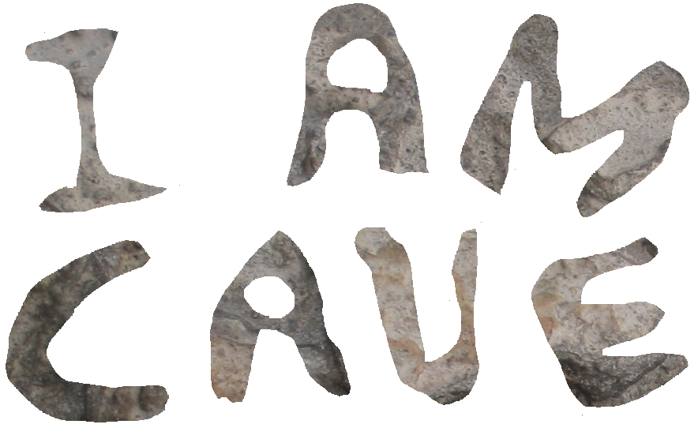

.. _Game Design Document:

Game Design Document
====================

--------------------

1. `Game Overview`_

   1. `Konzept und Genre`_
   2. `Plattform`_
   3. `Zielgruppe`_
   4. `Stil des Spiels`_
   5. `Musik und Sounds`_

2. `Gameplay/Mechanics`_

   1. `Gameplay und Ziele`_
   2. `Mechanics`_

      1. `Ressourcen`_
      2. `Spieleraktionen`_
      3. `Ereignisse`_
      4. `Interface und Steuerung`_
      5. `Konflikte und Hindernisse`_

   3. `Optionen und Speichermöglichkeiten`_

3. `Story`_

   1. `Hintergrundgeschichte`_
   2. `Spielbegleitende Geschichte`_

4. `Anhang`_

--------------------

Game Overview
-------------

Konzept und Genre
^^^^^^^^^^^^^^^^^

Beim Survival-Management-Spiel “I am Cave” sieht der Spieler sich mit spannenden
Herausforderungen konfrontiert, die den realen Problemen des Zusammenlebens in
der Vorzeit entlehnt sind. Durch geschicktes Einsetzen von selbst erarbeiteten
Ressourcen, muss der Spieler eine Gruppe Höhlenmenschen durch die Zeit lenken,
um mit ihnen eine neue, blühende Form der Zivilisation zu erreichen.

Plattform
^^^^^^^^^

Das Spiel wird für den PC entwickelt und wird auf den
Microsoft-Windows-Versionen 7,8/8.1 und 10 lauffähig sein. Die Entwicklung wird
mithilfe eines Frameworks (SFML) in C++ geschehen.

Zielgruppe
^^^^^^^^^^

Das Spiel ist für jeden Spieler geeignet, der neugierig auf das Leben in der
Steinzeit ist, der gern komplexes Management betreibt und der sich selbst gern
übertrifft und seine Vorgehensweise in Spielen zu perfektionieren lernen will.
Aufgrund mitunter schwerer Entscheidungen, die nachhaltige Einflüsse auf das
(Über-)Leben der Gruppe haben, erlebt der Spieler das Spiel hautnah mit und wird
in dessen Bann gezogen.Kurz: wer sich gern mit großen Herausforderungen, aber
auch Belohnungen konfrontiert sieht, ist hier genau richtig!

Stil des Spiels
^^^^^^^^^^^^^^^

Das Spiel versprüht durch seinen minimalistisch-liebevollen Stil Charme und
fesselt den Spieler, dem es so gelingt, eine fast persönliche Bindung zu den
Spielecharakteren aufzubauen. Damit der Spaß an dem Spiel nicht zu kurz kommt,
gibt es überall humoristisch angehauchte Passagen zu entdecken, denn an
Selbstironie wird nicht gespart. Obwohl die Grafiken hauptsächlich aus freien
Bibliotheken stammen, werden sie so angepasst, dass sie sich perfekt in die
Steinzeitwelt von I am Cave einfügen.

Musik und Sounds
^^^^^^^^^^^^^^^^

Musik und Soundeffekte sollen, ebenso wie die Grafik, minimalistisch gehalten
sein. Es werden Sounds verwendet, die vom Spieler in Verbindung mit dem Leben in
einer Höhle gebracht werden. Der Verzicht auf komplexe musikalische Untermalung
verstärkt die Immersion weiterhin. Auch hier soll der Fokus auf Humor gelegt
werden (etwaiges Grunzen der Höhlenbewohner etc.), damit das Spielgefühl nicht
zu steif wirkt und das humoristische Potenzial des Settings ausgeschöpft wird.
Die Effekte werden größtenteils aus frei verfügbaren Soundbibliotheken bezogen.

Gameplay/Mechanics
------------------

Gameplay und Ziele
^^^^^^^^^^^^^^^^^^

Musik und Soundeffekte sollen, ebenso wie die Grafik, minimalistisch gehalten
sein. Es werden Sounds verwendet, die vom Spieler in Verbindung mit dem Leben in
einer Höhle gebracht werden. Der Verzicht auf komplexe musikalische Untermalung
verstärkt die Immersion weiterhin. Auch hier soll der Fokus auf Humor gelegt
werden (etwaiges Grunzen der Höhlenbewohner etc.), damit das Spielgefühl nicht
zu steif wirkt und das humoristische Potenzial des Settings ausgeschöpft wird.
Die Effekte werden größtenteils aus frei verfügbaren Soundbibliotheken bezogen.

Mechanics
^^^^^^^^^

Ressourcen
~~~~~~~~~~

+-----------------+------------------+---------------------+---------------------------------+
| Aktion          | Ressourcenerwerb | Ressourcenverbrauch | Ziel                            |
+=================+=========+========+=====================+=================================+
| Jagen           | Nahrung          | Runden              | Ernährung des Stammes           |
+-----------------+------------------+---------------------+---------------------------------+
| Sammeln         | Materialien      | Runden              | Baumaterial                     |
+-----------------+------------------+---------------------+---------------------------------+
| Höhle ausbauen  | \-               | Materialien, Runden | höhere Kapazität von Bewohnern  |
+-----------------+------------------+---------------------+---------------------------------+
| Denken/Forschen | \-               | Runden              | neue Boni, Abschluss des Spiels |
+-----------------+------------------+---------------------+---------------------------------+
| Fortpflanzen    | Höhlenbewohner   | Runden              | Vergrößerung des Stammes        |
+-----------------+------------------+---------------------+---------------------------------+

Um das Spiel zu gewinnen, ist gutes Ressourcenmanagement unerlässlich. Zu den
Ressourcen gehören:

Höhlenbewohner sind die wichtigste Ressource. Der Spieler startet mit ein paar
wenigen Höhlenbewohnern und kann die Anzahl im Laufe des Spiels erhöhen. Jeder
Höhlenbewohner hat einen Namen sowie die Attribute Geschlecht, Fitness (für
Jagen bei männlichen und Sammeln bei weiblichen Bewohnern) und Intelligenz.
Höhlenbewohner verbrauchen jede Runde einen feste Anzahl Nahrung.

Runden bzw. Zeit stellen eine weitere Ressource dar. Es stehen nur eine vorher
festgelegte Anzahl Runden zur Verfügung und es ist nicht möglich, mehr hinzu zu
gewinnen. Die Dauer aller Aktionen im Spiel wird in Runden gemessen.

Weitere Ressourcen sind Nahrung und Materialien. Diese sind zu Beginn nicht oder
kaum vorhanden. Sie werden durch Spieleraktionen gewonnen und auch wieder
verbraucht; mehr dazu im nächsten Abschnitt.

Spieleraktionen
~~~~~~~~~~~~~~~

Die verschiedenen Aktionen, die dem Spieler während jeder Runde zur Verfügung
stehen, gliedern sich wie folgt:

Jagen
    Verwendet mindestens einen männlichen(!) Höhlenbewohner und **erzeugt
    Nahrung**.  Die Überlebenschance und Größe der Ausbeute skaliert mit der
    Anzahl der jagenden Höhlenmenschen und deren Fitness-Skills. Jagen dauert
    eine Zeiteinheit und es kann genau eine Jagen-Aktion pro Runde ausgeführt
    werden. Erfolgreiches Jagen erhöht den Fitness-Skill.

Sammeln
    Verwendet mindestens einen weiblichen(!) Höhlenbewohner und **erzeugt
    Materialien**. Die Größe der Ausbeute skaliert mit der Anzahl der sammelnden
    Höhlenmenschen und deren Fitness-Skills. Sammeln dauert eine Zeiteinheit und
    es kann genau eine Sammeln-Aktion pro Runde ausgeführt werden. Erfolgreiches
    Sammeln erhöht den Fitness-Skill.

Höhle ausbauen
   Verwendet mindestens einen Höhlenbewohner und **verbraucht Materialien**. Das
   Ausbauen der Höhle ermöglicht eine höhere Einwohnerkapazität und ist somit
   essenziell, um den Stamm zu vergrößern. Die notwendige Anzahl der Runden
   ändert sich mit der Anzahl der bauenden Höhlenmenschen und des zu bauenden
   Einrichtungtyps. Es kann genau eine Höhle-ausbauen-Aktion pro Runde
   ausgeführt werden bzw. gleichzeitig aktiv sein.

Denken/Forschen
   Verwendet genau einen Höhlenbewohner und **verbraucht Essen und
   Materialien**. Um das Ziel des Spiels (Ackerbau) zu erreichen, ist es
   notwendig, zu forschen. Je nach aktuellem Forschungszweig und
   Intelligenz/Anzahl der forschenden Höhlenmenschen variieren die verbrauchten
   Ressourcen sowie die notwendige Zeit. Es kann nur eine gleichzeitige
   Denken-Aktion gleichzeitig ausgeführt werden. (Techtree siehe Anhang 1).
   Erfolgreiches Forschen erhöht die Intelligenz der Bewohner.

Fortpflanzen
    Benötigt genau einen weiblichen und einen männlichen Höhlenbewohner. Erzeugt
    einen bis zwei neue Höhlenbewohner mit zufälligem Geschlecht. Der männliche
    Höhlenbewohner ist eine Runde beschäftigt, der Weibliche über mehrere Runden
    (Schwangerschaft). Es können mehrere Fortpflanzen-Aktionen pro Runde
    ausgeführt werden. Mit beschäftigten/bereits schwangeren weiblichen
    Bewohnern kann sich nicht fortgepflanzt werden.

Ereignisse
~~~~~~~~~~

Nach einigen Runden besteht die Chance, ein zufälliges Ereignis auszulösen. Im
folgenden seien zwei Beispiele angeführt:

Ein Mitglied eines anderen Stammes erscheint in der Höhle und bietet dem Spieler
einen zufällig generierten Tauschhandel an (Ressource x gegen Ressource y). Der
Spieler hat die Wahl, den Vorschlag anzunehmen oder abzulehnen.

Der Spieler erhält die Meldung, dass das Wetter umschlägt; es sieht so aus, als
würde es stürmischer werden. Dies bedeutet, dass in der übernächsten Runde die
Höhle nicht verlassen werden kann (kein Sammeln oder Jagen möglich).

Interface und Steuerung
~~~~~~~~~~~~~~~~~~~~~~~

Das Spiel wird ausschließlich mit der Maus bedient. Die meiste Zeit über
befindet sich der Spieler in  der Auswahlübersicht zwischen den Runden. In
dieser Ansicht werden am oberen Rand die aktuellen Ressourcen (Rundenzahl,
Bewohner, Nahrung, Materialien) angezeigt. Aktionen können ausgewählt werden, in
dem der Spieler mit der Maus auf die visualisierten Orte in der Höhle klickt.
Ein Beispiel für diese Anwendung wäre es, auf den Eingang zu klicken, um in
einem Pop-Up Fenster Höhlenbewohner zum Jagen und Sammeln während dieser Runde
zu selektieren. Alle aktiven Aktionen werden durch ein passendes ‘Busy’-Icon
über ihrem jeweiligen Referenzort in der Höhle angezeigt. Auf der rechten Seite
des Bildschirms sieht man die Höhlenbewohner und kann sich die Attribute sowie
den aktuellen Zustand durch Anklicken eines Bewohners anschauen.

Ist man mit allen Aktionen zufrieden, betätigt man den Button für den Übergang
zur nächsten Runde und die nächste Runde wird gestartet. Zu Beginn der nächsten
Runde werden dem Spieler die Ergebnisse der letzten Runde in einer Übersicht
präsentiert. Zu guter Letzt befinden sich rechts unten zwei Buttons für Optionen
und Statistiken, die angesehen werden können (z.B. Diagramm von eingelagerten
Ressourcenmengen über alle bisherigen Runden hinweg).

Je nach Spielentwicklung und Ausbau der Höhle, wird die Höhle dem Spieler anders
präsentiert. Ist die Forschung beispielsweise weit vorangeschritten, macht sich
dies in Form  eines großen Forschungsplatzes und anderen ausgebauten
Einrichtungen bemerkbar.

Konflikte und Hindernisse
~~~~~~~~~~~~~~~~~~~~~~~~~

Die Herausforderung des Spiels besteht in dem erfolgreichen Balancieren aller
verfügbaren Ressourcen, um einen kontinuierlichen Fortschritt zu erzielen. Steht
zum Beispiel in einer Runde nicht genug Nahrung für alle Höhlenbewohner bereit,
werden einige Menschen Hunger leiden und nach mehreren Runden sogar sterben.
Sammelt man jedoch jede Runde nur Nahrung und vernachlässigt die Forschung oder
die Fortpflanzung, wird man niemals rechtzeitig das vorgegebene Spielziel
erreichen, bevor die verbleibenden Runden verbraucht sind. Zusätzlich sind die
verschieden ausgeprägten Talente der Bewohner sowie Ereignisse zu beachten.

Optionen und Speichermöglichkeiten
^^^^^^^^^^^^^^^^^^^^^^^^^^^^^^^^^^

Für das Optionsmenü geplante Optionen sind:
SOUND EIN/AUS, SPIEL NEUSTARTEN, SPIEL BEENDEN
Das Spiel speichert selbstständig nach jeder Runde und bei jedem Start wird der
letzte Stand automatisch geladen.

Story
-----

Hintergrundgeschichte
^^^^^^^^^^^^^^^^^^^^^

Die Geschichte von ‘I am Cave’ wird von realen historischen Begebenheiten
getragen, welche sich durch das gesamte Spiel ziehen und dem Spieler die Urzeit
sowie die zu dieser Zeit aktuellen Probleme und Herausforderungen näherbringen.

Der Hauptfokus liegt hierbei auf einem einzelnen Stamm, welcher, angeführt von
dem Spieler, bestimmte, für diese Zeit relevante, Meilensteine erreichen soll,
um so den Schritt in die nächste Epoche der Menschheitsgeschichte zu absolvieren
und sein Überleben zu sichern.

Zeitlich gliedert sich das Spiel an das Ende der Altsteinzeit beziehungsweise
dem Beginn der Jungsteinzeit während des Pleistozän an (wir sprechen von ~12.000
v. Chr.), als die Menschheit im Rahmen der neolithischen Revolution sesshaft
wurde und begann, von Ackerbau und Viehhaltung Gebrauch zu machen.

Spielbegleitende Geschichte
^^^^^^^^^^^^^^^^^^^^^^^^^^^

Umgesetzt wird die Story mit Pop-Up Textboxen, welche dem Spieler zu Anfang
einer jeden neuen Runde über Ereignisse und Auswertungen Bericht erstatten.

Ein primärer Aspekt der zu erzählenden Geschichte ist ein spannender und
sogleich humoristischer Stil.  Passende Soundeffekte wie gelegentliches Grunzen
der Höhlenbewohner oder an die Situation angepasste Umgebungsgeräusche sollen
mit der Erzählweise harmonieren und so Immersion und Feedback des Spiels
fördern.  Da die Geschichte des Spiels ausschließlich in schriftlicher Form und
ohne Sprecher erfolgt, wird ein großer Wert auf die textliche Ausgestaltung
gelegt.

Pop-Up Fenster mit Storyelementen tauchen situationsbedingt auf: Nach der
erfolgreichen Erforschung einer Technologie in Form von humoristischen
Kommentaren oder reale Referenzen zu den jeweiligen Forschungen; bei
getriggerten Spielereignissen wie die Entdeckung eines benachbarten Stammes oder
einer nahegelegenen Tierherde.  Viele Ereignisse im Spiel werden nach einer
Spieleraktion, wie zum Beispiel einer Jagdtour, oder abhängig von der aktuellen
Runde getriggert.

Die Story wird generell spielbegleitend eingesetzt, was in diesem Fall heißt,
dass der Spieler in jedem erneuten Durchlauf seine eigene individualisierte
Story mit seinen Entscheidungen schreibt, welche sich auf den weiteren Verlauf
des Spiels auswirken.

Das Ende des Spiels wird mit dem endgültigen Vollenden der neolithischen
Revolution (Entdeckung des Ackerbaus) erreicht, da die Menschen zu dieser Zeit
beginnen, ihre Höhlen zu verlassen und ihre Standorte nach Fruchtbarkeit des
Bodens auswählen und das Szenario der Höhlenmenschen zu diesem Zeitpunkt endet.

Anhang
------

