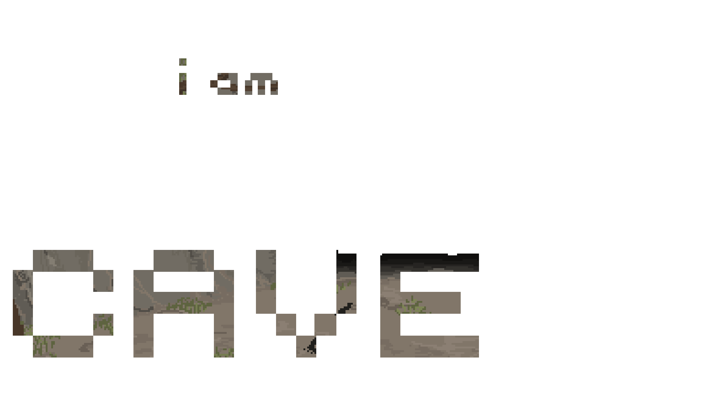

.. _Game Design Document:

Game Design Document
====================

--------------------

.. sectnum::

.. contents:: Table of Contents

--------------------

Game Overview
-------------

Konzept und Genre
^^^^^^^^^^^^^^^^^

Beim Survival-Management-Spiel “I am Cave” sieht der Spieler sich mit spannenden
Herausforderungen konfrontiert, die den realen Problemen des Zusammenlebens in
der Vorzeit entlehnt sind. Durch geschicktes Einsetzen von selbst erarbeiteten
Ressourcen, muss der Spieler eine Gruppe Höhlenmenschen durch die Zeit lenken,
um mit ihnen eine neue, blühende Form der Zivilisation zu erreichen.

Plattform
^^^^^^^^^

Das Spiel wird für den PC entwickelt und wird auf den
Microsoft-Windows-Versionen 7,8/8.1 und 10 lauffähig sein. Die Entwicklung wird
mithilfe eines Frameworks (SFML) in C++ geschehen.

Zielgruppe
^^^^^^^^^^

Das Spiel ist für jeden Spieler geeignet, der neugierig auf das Leben in der
Steinzeit ist, der gern komplexes Management betreibt und der sich selbst gern
übertrifft und seine Vorgehensweise in Spielen zu perfektionieren lernen will.
Aufgrund mitunter schwerer Entscheidungen, die nachhaltige Einflüsse auf das
(Über-)Leben der Gruppe haben, erlebt der Spieler das Spiel hautnah mit und wird
in dessen Bann gezogen. Kurz: wer sich gern mit großen Herausforderungen, aber
auch Belohnungen konfrontiert sieht, ist hier genau richtig!

Stil des Spiels
^^^^^^^^^^^^^^^

Das Spiel versprüht durch seinen minimalistisch-liebevollen Stil Charme und
fesselt den Spieler, dem es so gelingt, eine fast persönliche Bindung zu den
Spielecharakteren aufzubauen. Damit der Spaß an dem Spiel nicht zu kurz kommt,
gibt es überall humoristisch angehauchte Passagen zu entdecken, denn an
Selbstironie wird nicht gespart. Die Grafik wird in liebevollem Pixel-Art-Stil
entwickelt, der perfekt zum prähistorischen Setting des Spiels passt.

Musik und Sounds
^^^^^^^^^^^^^^^^

Musik und Soundeffekte sollen, ebenso wie die Grafik, minimalistisch gehalten
sein. Es werden Sounds verwendet, die vom Spieler in Verbindung mit dem Leben in
einer Höhle gebracht werden. Der Verzicht auf komplexe musikalische Untermalung
verstärkt die Immersion weiterhin. Auch hier soll der Fokus auf Humor gelegt
werden (etwaiges Grunzen der Höhlenbewohner etc.), damit das Spielgefühl nicht
zu steif wirkt und das humoristische Potenzial des Settings ausgeschöpft wird.
Die Effekte werden größtenteils aus frei verfügbaren Soundbibliotheken bezogen.

Gameplay/Mechanics
------------------

Gameplay und Ziele
^^^^^^^^^^^^^^^^^^

Das Spiel ist rundenbasiert, wobei eine Runde im Spiel mehrere Wochen (Ingame-
Zeit) darstellt. Zwischen zwei Runden wählt der Spieler Aktionen aus die während
der nächsten Zeiteinheit ausgeführt werden. Ist der Spieler mit seiner Auswahl
zufrieden betätigt er den ‘Go’-Button, der die nächste Runde startet und
sämtliche ausgewählte Aktionen ausführt. Welche und wieviele Aktionen während
einer Runde ausgewählt werden können, ist dabei abhängig von den zur Verfügung
stehenden Ressourcen. Wenn es dem Spieler innerhalb einer vorher festgelegten
Anzahl Runden gelingt, die neolithische Revolution zu erreichen, hat er das
Spiel erfolgreich abgeschlossen. Dieser Zeitrahmen ist durch die permanente
Anwesenheit der Höhlenbewohner in einem gleichbleibenden Jagdgrund und die dadurch
entstehende Ressourcenknappheit zu begründen.

Mechanics
^^^^^^^^^

Ressourcen
~~~~~~~~~~

+-----------------+------------------+---------------------+---------------------------------+
| Aktion          | Ressourcenerwerb | Ressourcenverbrauch | Ziel                            |
+=================+=========+========+=====================+=================================+
| Jagen           | Nahrung          | Runden              | Ernährung des Stammes           |
+-----------------+------------------+---------------------+---------------------------------+
| Sammeln         | Materialien      | Runden              | Baumaterial                     |
+-----------------+------------------+---------------------+---------------------------------+
| Höhle ausbauen  | \-               | Materialien, Runden | höhere Kapazität von Bewohnern  |
+-----------------+------------------+---------------------+---------------------------------+
| Denken/Forschen | \-               | alle, je nach Tech  | neue Boni, Abschluss des Spiels |
+-----------------+------------------+---------------------+---------------------------------+
| Fortpflanzen    | Höhlenbewohner   | Runden              | Vergrößerung des Stammes        |
+-----------------+------------------+---------------------+---------------------------------+

Um das Spiel zu gewinnen, ist gutes Ressourcenmanagement unerlässlich. Zu den
Ressourcen gehören:

Höhlenbewohner
    Höhlenbewohner sind die wichtigste Ressource. Der Spieler startet mit ein paar
    wenigen Höhlenbewohnern (derzeit 5) und kann die Anzahl im Laufe des Spiels
    erhöhen. Jeder Höhlenbewohner hat einen Namen sowie die Attribute Geschlecht,
    Fitness, Alter und Intelligenz.

    Alle Höhlenbewohner verbrauchen jede Runde passiv Nahrung. Eine Ausnahme davon
    bilden Höhlenmenschen die sich auf der Jagd befinden, da sich diese von ihren
    Erträgen selbst versorgen. Der passive Nahrungsverbrauch für einen Bewohner
    berechnet sich wie folgt:

    Nahrungsverbrauch = 5 + (0,1*Fitness) + Zusatzverbrauch

    wobei der Zusatzverbrauch ein zufälliger Betrag zwischen 0 und 0,33 ist.
    Sollte in einer Runde nicht genug Nahrung für jeden Bewohner vorhanden sein,
    verliert jeder hungernder Bewohner 1 Fitness. Ein Höhlenbewohner mit
    Fitness 0 stirbt, sprich er wird aus dem Stamm entfernt.
    Die 5 Startbewohner in einem neuem Spiel haben folgende Eigenschaften:
    - 3 männliche, 2 weibliche mit Alter 5
    - Fitness und Intelligenz zufällig zwischen 1 und 5

Runden/Zeit
    Runden bzw. Zeit stellen eine weitere Ressource dar. Es stehen nur eine vorher
    festgelegte Anzahl Runden zur Verfügung und es ist nicht möglich, mehr hinzu zu
    gewinnen. Die Dauer aller Aktionen im Spiel wird in Runden gemessen.
    Im derzeitigen Prototyp beträgt die maximale Anzahl an Runden 100.
    Jeder Höhlenbewohner altert jede Runde um 1. Ab einem Alter von 50 Jahren
    können Höhlenbewohner keine Fitness mehr dazu gewinnen und verlieren statt-
    dessen mit Ablauf jeder Runde 5 Fitness.

Weitere Ressourcen sind Nahrung und Materialien. Diese sind zu Beginn nicht oder
kaum vorhanden. Sie werden durch Spieleraktionen gewonnen und auch wieder
verbraucht; mehr dazu im nächsten Abschnitt.
Die derzeitigen Startressourcen betragen 200 Essen, 50 Materialien und eine
maximale Höhlenkapazität von 5.

Spieleraktionen
~~~~~~~~~~~~~~~

Die verschiedenen Aktionen, die dem Spieler während jeder Runde zur Verfügung
stehen, gliedern sich wie folgt:

Jagen
    Verwendet mindestens einen männlichen(!) Höhlenbewohner und **erzeugt
    Nahrung**.  Die Größe der Ausbeute skaliert mit der Anzahl der jagenden
    Höhlenmenschen und deren Fitness-Skills. Es gibt 2 Jagdrouten, eine einfache
    und eine schwierige. Einfaches Jagen dauert 3 Runden und die teilnehmenden
    Höhlenmenschen haben eine Chance von 1 zu 100 dabei zu sterben. Schwieriges
    Jagen dauert 5 Runden und die teilnehmenden Höhlenmenschen haben eine Chance
    von 1 zu 10 zu sterben. Ein Erfolgreiches Jagen erhöht das Fitness Attribut
    aller Teilnehmer um 1 bei einfachem und um 2 bei schwierigem Jagen.
    Es können beliebig viele Jagen Aktionen zur gleichen Zeit aktiv sein.
    Die Ausbeute berechnet sich wie folgt:

    Ausbeute = 20 + (Gesamtfitness*Gesamtzeit) + Boni durch Techs

    Die Gesamtfitness ist dabei die addierte Fitness aller Teilnehmer und
    die Gesamtzeit die Dauer der Aktion in Runden. Der Zuwachs an Fitness bei
    aktiver Teilnahme am Jagen kann ebenfalls durch Techs modifiziert werden.

Sammeln
    Verwendet mindestens einen weiblichen(!) Höhlenbewohner und **erzeugt
    Materialien**. Die Größe der Ausbeute skaliert mit der Anzahl der sammelnden
    Höhlenmenschen und deren Fitness-Skills. Sammeln dauert stets 3 Runden und
    die Teilnehmer haben eine Chance von 1 zu 50 dabei zu sterben.
    Erfolgreiches Sammeln erhöht das Fitness Attribut um 1.
    Es können beliebig viele Sammeln Aktionen gleichzeitig stattfinden.
    Die Ausbeute berechnet sich wie folgt:

    Ausbeute = (Gesamtfitness*Gesamtzeit) + Boni durch Techs

    Der Zuwachs an Fitness bei aktiver Teilnahme am Jagen kann ebenfalls durch
    Techs modifiziert werden.

Höhle ausbauen/verbessern
   Verwendet mindestens einen Höhlenbewohner und verbraucht genau 30 **Materialien**.
   Das Ausbauen der Höhle ermöglicht eine höhere Einwohnerkapazität und ist somit
   essenziell, um den Stamm zu vergrößern. Die notwendige Anzahl der Runden
   ändert sich mit der Anzahl der bauenden Höhlenmenschen. Sie berechnet sich
   wie folgt:

   Aktionsdauer = 10 * 0.5^(Teilnehmeranzahl-1)

   Die Aktion erhöht die Höhlenkapazität standardmäßig um 1, diese Zahl kann
   jedoch durch Techs erhöht werden.

Denken/Forschen
   Verwendet genau einen Höhlenbewohner und **verbraucht Essen und
   Materialien**. Um das Ziel des Spiels (Ackerbau) zu erreichen, ist es
   notwendig, zu forschen. Für sämtliche Forschungen wird eine Mindest-
   Intelligenz des forschenden Bewohners benötigt. Je nach aktuellem
   Forschungszweig variieren die verbrauchten Ressourcen sowie die notwendige
   Zeit. Die Boni der Techs variieren ebenfalls. Für eine genaue Auflistung siehe
   Abschnitt Techtree. Erfolgreiches Forschen erhöht die Intelligenz der Bewohner.

Fortpflanzen
    Benötigt genau einen weiblichen und einen männlichen Höhlenbewohner. Erzeugt
    einen neuen Höhlenbewohner. Der männliche Teilnehmer ist eine Runde
    beschäftigt, der weibliche über drei Runden (Schwangerschaft). Es kann nur
    eine Fortpflanzen-Aktionen gleichzeitig ausgeführt werden. Die Chance auf
    eine erfolgreiche Geburt ist 90 Prozent. Sollte bei Ablauf der Aktion keine
    zusätzliche Kapazität in der Höhle vorhanden sein kommt es ebenfalls zu einer
    Fehlgeburt (kein neuer Höhlenmensch kommt dazu). Generell ist das Geschlecht
    des neuen Bewohners zufällig, ist aber bei Ablauf der Aktion nur noch einer
    oder weniger männliche Bewohner im Stamm vorhanden wird ein Junge geboren,
    gleiches gilt für weibliche Bewohner.

Techtree
~~~~~~~~

    Screenshot des aktuellen Ingame-Techtrees

Der Techtree enthält alle Forschungen und wird über den Denken-Aktionsbutton
im Hauptscreen aufgerufen. Zusätzlichen zu allen Techs befindet sich auch eine
Trainingsaktion ('ponder' Button) Tree. Es kann stets nur eine Tech gleichzeitig
erforscht werden, jedoch zusätzlich noch beliebig viele Trainingsaktionen
durchgeführt werden. Um eine Tech zu erforschen wählt der User zunächst das
entsprechende Tech-Icon und klickt dann den Confirm-Button um einen forschenden
Höhlenbewohner auszuwählen. Im Folgenden werden alle Techs mit den dazugehörigen Kosten
und resultierenden Boni nach derzeitigem Entwicklungsstand aufgelistet.
(Reihenfolge im Screenshot von links, nach rechts und oben nach unten):

Handaxe
    | Voraussetzungen: 4 Intelligenz, 150 Nahrung, 30 Materialien
    | Dauer: 3 Runden
    | Boni: +5 Jagdertrag, +2 Sammelertrag, +5 Intelligenz

Pottery
    | Voraussetzungen: 25 Intelligenz, 300 Nahrung
    | Dauer: 4 Runden
    | Boni: +30 Sammelertrag, +0,3 Fitnesszuwachs, + 4 Intelligenz

Hierarchy
    | Voraussetzungen: 30 Intelligenz, 300 Nahrung, 100 Materialien
    | Dauer: 4 Runden
    | Boni: +20 Jagdertrag, +20 Sammelertrag, +0,3 Fitnesszuwachs, +1 passiver Intelligenzuwachs,
    | keine Fehlgeburten mehr, +1 Ausbauen Bonus, +6 Intelligenz

Axe
    | Voraussetzungen: 10 Intelligenz, 200 Nahrung, 80 Materialien
    | Dauer: 3 Runden
    | Boni: +10 Jagdertrag, +10 Sammelertrag, +0,3 Fitnesszuwachs, +3 Intelligenz

Pickaxe
    | Voraussetzungen: 35 Intelligenz, 100 Nahrung, 150 Materialien
    | Dauer: 3 Runden
    | Boni: +30 Jagdertrag, +2 Höhle ausbauen Bonus, +7 Intelligenz

Spear
    | Voraussetzungen: 20 Intelligenz, 250 Nahrung, 100 Materialien
    | Dauer: 4 Runden
    | Boni: +60 Jagdertrag, +0,4 Fitnesszuwachs, +3 Intelligenz

Plaiting
    | Voraussetzungen: 15 Intelligenz, 150 Nahrung, 80 Materialien
    | Dauer: 2 Runden
    | Boni: +10 Jagdertrag, +1 passiver Intelligenzzuwachs, +3 Intelligenz

Archery
    | Voraussetzungen: 35 Intelligenz, 200 Nahrung, 200 Materialien
    | Dauer: 5 Runden
    | Boni: +50 Jagdertrag, +0,8 Fitnesszuwachs, +10 Intelligenz

Wooden Fence
    | Voraussetzungen: 50 Intelligenz, 500 Nahrung, 300 Materialien
    | Dauer: 4 Runden
    | Boni: +0,5 Fitnesszuwachs, +1 Höhle ausbauen Bonus, +5 Intelligenz

Basket
    | Voraussetzungen: 30 Intelligenz, 300 Materialien
    | Dauer: 2 Runden
    | Boni: +40 Jagdertrag, +0,2 Fitnesszuwachs, +4 Intelligenz

Neolithic Revolution
    | Voraussetzungen: 70 Intelligenz, 1000 Nahrung, 500 Materialien
    | Dauer: 6 Runden
    | Boni: Gewinn des Spiels!

Training/Ponder
    | Voraussetzungen: keine
    | Dauer : 1 Runde
    | Boni: +2 Intelligenz

Weiterhin können bereits erforschte Techs auch Auslöser und/oder Voraussetzung
für zufällige Ereignisse sein, dazu mehr im nächsten Abschnitt.

Ereignisse
~~~~~~~~~~

Nach jeder Runde besteht die Chance, ein zufälliges Ereignis auszulösen.
Die Ereignisse erscheinen in der Textbox des Rundenendscreens.
Im folgenden sei ein Beispiel angeführt:

Ein Mitglied eines anderen Stammes erscheint in der Höhle und bietet dem Spieler
einen zufällig generierten Tauschhandel an (Ressource x gegen Ressource y). Der
Spieler hat die Wahl, den Vorschlag anzunehmen oder abzulehnen.

Interface und Steuerung
~~~~~~~~~~~~~~~~~~~~~~~

Das Spiel wird ausschließlich mit der Maus bedient. Die meiste Zeit über
befindet sich der Spieler in  der Auswahlübersicht zwischen den Runden (siehe Screenshot).
In dieser Ansicht werden innerhalb der Höhle die aktuellen Ressourcen
(Bewohner, Nahrung, Materialien) angezeigt. Zusätzliche werden diese durch grafische
Elemente (Bspw. Keulen für Nahrung) quantitativ visualisiert. Aktionen können ausgewählt werden, in
dem der Spieler mit der Maus auf die jeweiligen Buttons in der Höhle klickt.
Ein Beispiel für diese Anwendung wäre es, auf "Collect" oder "Hunt" zu klicken, um
daraufhin Bewohner zu selektieren, die an der Aktion teilnehmen sollen.
Alle aktiven Aktionen werden oben rechts in der Actionqueue anhand von Icons
angezeigt, aufsteigend geordnet nach verbleibender Dauer (von oben nach unten).
Durch Rechtsklicken auf einen Höhlenbewohner kann man sich seine Charakterwerte
(Fitness, Intelligenz, Alter) und seinen Namen ansehen.

.. figure:: img/management2.png
    :align: center
    :alt: Management Screen

    Screenshot der aktuellen Ingame-Auswahlübersicht/Managementscreen

Ist man mit allen Aktionen zufrieden, betätigt man den Button für den Übergang
zur nächsten Runde unten rechts. Zu Beginn der nächsten Runde werden dem Spieler
die Ergebnisse der letzten Runde in einer Übersicht präsentiert. Weiterhin werden
in dieser Ansicht zufällige Ereignisse präsentiert.

    Screenshot des aktuellen Ingame-Rundenendscreens mit Event in der Textbox

Je nach Spielentwicklung und Ausbau der Höhle, wird die Höhle dem Spieler anders
präsentiert. Die in der Höhle vorhandenen Ressourcenhaufen skalieren mit der Anzahl der vorhandenen
Ressourcen (Steine für Materialien,  Keulen für Fleisch) und die Höhlenmalerei verändert sich
je nach Kapazität der Höhle.

Konflikte und Hindernisse
~~~~~~~~~~~~~~~~~~~~~~~~~

Die Herausforderung des Spiels besteht in dem erfolgreichen Balancieren aller
verfügbaren Ressourcen, um einen kontinuierlichen Fortschritt zu erzielen. Steht
zum Beispiel in einer Runde nicht genug Nahrung für alle Höhlenbewohner bereit,
werden einige Menschen Hunger leiden und nach mehreren Runden sogar sterben.
Sammelt man jedoch jede Runde nur Nahrung und vernachlässigt die Forschung oder
die Fortpflanzung, wird man niemals rechtzeitig das vorgegebene Spielziel
erreichen, bevor die maximale Rundenzahl erreicht ist. Zusätzlich sind die
verschieden ausgeprägten Talente der Bewohner sowie Ereignisse zu beachten.

Optionen und Speichermöglichkeiten
^^^^^^^^^^^^^^^^^^^^^^^^^^^^^^^^^^

Im Hauptmenü befinden sich folgende Optionen:
SPIEL STARTEN, SPIEL BEENDEN, EREIGNISSE AN/AUS

Das Spiel speichert selbstständig nach jeder Runde und bei jedem Start wird der
letzte Stand automatisch geladen. (noch nicht implementiert)

Story
-----

Hintergrundgeschichte
^^^^^^^^^^^^^^^^^^^^^

Die Geschichte von ‘I am Cave’ wird von realistischen, historischen Begebenheiten
getragen, welche sich durch das gesamte Spiel ziehen und dem Spieler die Urzeit
sowie die zu dieser Zeit aktuellen Probleme und Herausforderungen näherbringen.

Der Hauptfokus liegt hierbei auf einem einzelnen Stamm, welcher, angeführt von
dem Spieler, bestimmte, für diese Zeit relevante, Meilensteine erreichen soll,
um so den Schritt in die nächste Epoche der Menschheitsgeschichte zu absolvieren
und sein Überleben zu sichern.

Zeitlich gliedert sich das Spiel an das Ende der Altsteinzeit beziehungsweise
dem Beginn der Jungsteinzeit während des Pleistozän an (wir sprechen von ~12.000
v. Chr.), als die Menschheit im Rahmen der neolithischen Revolution sesshaft
wurde und begann, von Ackerbau und Viehzucht Gebrauch zu machen.

Spielbegleitende Geschichte
^^^^^^^^^^^^^^^^^^^^^^^^^^^

Umgesetzt wird die Story mit Pop-Up Textboxen, welche dem Spieler zu Anfang
einer jeden neuen Runde über Ereignisse und Auswertungen Bericht erstatten.

Ein primärer Aspekt der zu erzählenden Geschichte ist ein spannender und
sogleich humoristischer Stil. Da die Geschichte des Spiels ausschließlich in schriftlicher Form und
ohne Sprecher erfolgt, wird ein großer Wert auf die textliche Ausgestaltung
gelegt.

Pop-Up Fenster mit Storyelementen tauchen situationsbedingt auf: Nach der
erfolgreichen Erforschung einer Technologie in Form von humoristischen
Kommentaren oder reale Referenzen zu den jeweiligen Forschungen; bei
getriggerten Spielereignissen wie die Entdeckung eines benachbarten Stammes oder
einer nahegelegenen Tierherde.  Viele Ereignisse im Spiel werden nach einer
Spieleraktion, wie zum Beispiel einer Jagdtour, oder abhängig von der aktuellen
Runde getriggert.

Die Story wird generell spielbegleitend eingesetzt, was in diesem Fall heißt,
dass der Spieler in jedem erneuten Durchlauf seine eigene individualisierte
Story mit seinen Entscheidungen schreibt, welche sich auf den weiteren Verlauf
des Spiels auswirken.

Das Ende des Spiels wird mit dem endgültigen Vollenden der neolithischen
Revolution (Entdeckung des Ackerbaus) erreicht, da die Menschen zu dieser Zeit
beginnen, ihre Höhlen zu verlassen und ihre Standorte nach Fruchtbarkeit des
Bodens auswählen und das Szenario der Höhlenmenschen zu diesem Zeitpunkt endet.

Anhang
------

    Konzept Techtree zu Entwicklungsbeginn
