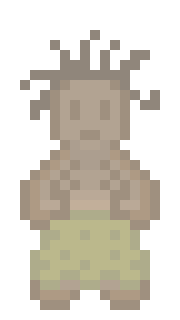
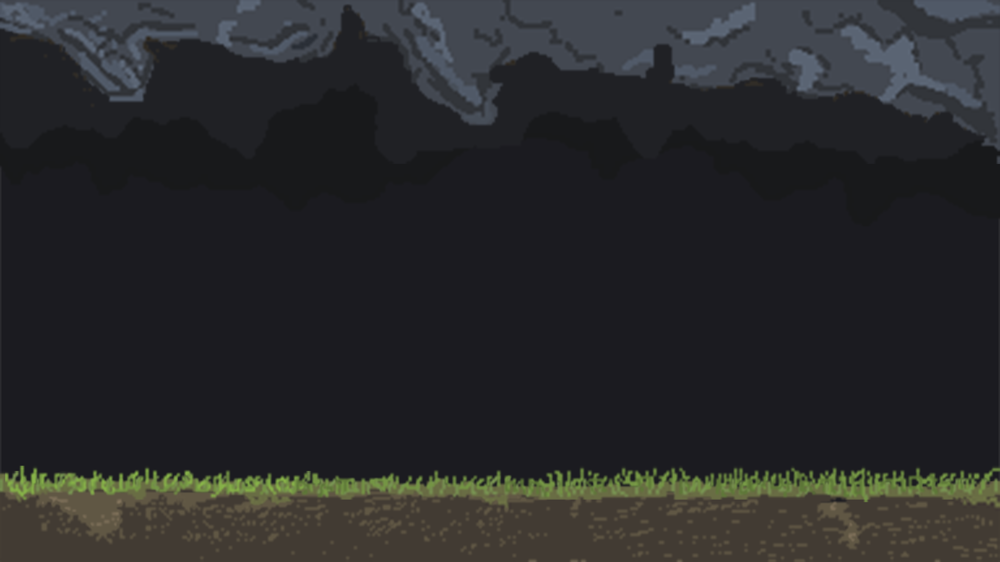

.. role:: cpp(code)
        :language: c++

Technical Design Document
=========================

.. image:: img/iamcavelogo.png
   :align: center
   :alt: IAmCave logo

--------------------

.. sectnum::

.. contents:: Table of Contents

--------------------

Entwicklungssoftware & Methodik
-------------------------------

Programmierung
^^^^^^^^^^^^^^

Das Spiel wird in C++ unter Verwendung des C++11 Standards programmiert.
Zusätzlich wird das Multimedia-Framework SFML 2.4 eingesetzt.

Um die Zusammenarbeit zu vereinfachen wird Git als version control system
benutzt. Die Git Repository befindet sich auf GitHub [#]_ .

Es wird die Methodik der Continuous Integration [#]_ angewandt, d.h. dass jedes
Teammmitglied bzw. jedes feature eine eigene branch hat auf die frei committet
werden kann.  Die master branch ist protected und pull requests müssen compilen
und von jedem anderen Teammmitglied reviewed werden bevor sie in die master
branch gemerged werden können.  Als CI Server wird Travis [#]_ benutzt.

Zur internen Organisation werden GitHub Funktionen wie Issues, Milestones und
Projects benutzt.

Ein einheitlicher Codingstil ist durch einen vorher verfassten Styleguide
festgelegt. Die Aufgabenverteilung erfolgt durch einen Ablaufplan.

Dokumentation
^^^^^^^^^^^^^

Die Dokumentation des Projekts erfolgt direkt im Code mittels Docstrings. Zur
Generierung der Dokumentation wird Doxygen [#]_ verwendet.

Input & Plattform
^^^^^^^^^^^^^^^^^

Die Ziel- und Testplattform der Entwicklung sind Windowsrechner.  Das Spiel
wird ausschließlich mit der Maus gesteuert; es wurden noch keine Tastaturbefehle
implementiert. Basierend auf dieser Restriktion wird ebenfalls eine mögliche
Umsetzung auf Touch-Geräten als Langzeit-Meilenstein angestrebt.

Assets
------

Grafik
^^^^^^

Primär werden die Character-Sprites, Backgrounds sowie Texturen von Hand
gezeichnet (Graphics Tablet). Weiteres dazu in der Art Bible.
Für die Grafiken der Höhlenmenschen wurden zunächst verschiedene Gesichter,
Haarstile und Kleidungen gezeichnet und dann mittels eines C# Skripts dynamisch
zusammen gesetzt.

Grafikformate
^^^^^^^^^^^^^

Das Spiel wird im 16:9 Format dargestellt, die Auflösung und Fenstergröße ist
über den Windows Fenstermanager beliebig durch den User veränderbar. Die Grafiken
werden im .png Format abgespeichert. Es wird keine 3D-Modelle in der Anwendung geben,
da das Spiel ohne simulierte Physik und räumliche Darstellung auskommt.
Alle Modelle und Effekte sind ausschließlich 2D.

Mainscreen und Mockups
^^^^^^^^^^^^^^^^^^^^^^

Der 2D Mainscreen wird eine interaktive Höhlen Übersicht darstellen.
Der Spieler wird die Möglichkeit haben,
sämtliche für ihn relevanten Informationen in Form von natürlich-grafischem
Feedback zu erhalten (Details im folgenden Abschnitt). Sämtliche Interaktionen
können ebenfalls von diesem Mainscreen aus ausgeführt werden.

    Screenshot des Management Screens

**Liste an sichtbaren Elementen und Informationen des Mainscreens:**

- Rundenzahl (am Anfang jeder Runde in der Textbox)
- Verfügbare Menge an Nahrung
- Verfügbare Menge an Materialien
- Maximalzahl an Einwohnern
- Menge an nicht-zugewiesenen Höhlenbewohnern (Dargestellt durch Menge an
  interaktiven Höhlenbewohner-Grafiken in der Mitte des Screens)
- Aktionen ‘Hunt’, ‘Collect’, ‘Think’, ‘Make Love’, ‘Improve’
- Button zum Beenden der Runde (‘Go’)
- Balken zur Darstellung bereits ausgewählter und laufender Aktionen

**Zusätzliche Darstellungsfeatures:**

- Einzelne Ressourcenhaufen (Darstellung variiert nach Menge der jeweiligen
  Ressource)
- Erwerbbare Einrichtungsobjekte
- Umgebungsanimation/-shader (Feuer, Höhlenbewohnertätigkeiten)

Interaktion
-----------

Jagen und Sammeln
^^^^^^^^^^^^^^^^^

Eine durch den Spieler anwählbare Aktion; Liefert pro Höhlenbewohner eine höhere
Anzahl des angeforderten Rohstoffes. Anzahl der Höhlenbewohner, Technologiestufe
und durchschnittliches Fitnesslevel bestimmen Output. Der Hunting Bonus wird
durch Forschung erhöht. Einfaches und schwieriges Jagen;
in Notlagen führt schwieriges Jagen zu “High risk, high reward”; Abzuwägen durch den Spieler

Beispiel:
Nach beendeter Aktion
Food=Food + SUM(Fitness aller beteiligten Caveman)+Hunting Bonus
Chance, das Caveman stirbt, berechnen
Erhöhe Fitness der Beteiligten.

Fortpflanzung
^^^^^^^^^^^^^

Eine durch den Spieler anwählbare Aktion; Dauert 1 Runde; Benötigt genau 2
erwachsene Höhlenbewohner; Das Alter sowie die Geschlechterverteilung der mit
dieser Aufgabe beschäftigten Höhlenbewohner bestimmen den ‘Output’; Wenn
erfolgreich wird der weibliche Höhlenbewohner schwanger und ist 3 Runden lang
nicht verfügbar.

Zu 90% erfolgreich bei heterosexuellem Verkehr.

Forschungen
^^^^^^^^^^^

Eine durch den Spieler anwählbare Aktion; Dauert mehrere Runden(abhängig von der
gewählten Forschung); Erfolgreiches Forschen erhöht Intelligenz.
Forschungen haben verschiedene Effekte auf Ressourcenanhäufung und Events (siehe
Techtree im Game Design Document). Forschungen werden in Form von JSON Dateien
gespeichert. Zum Einlesen der Dateien wird in den entsprechenden Klassen die
externe Header Datei json.hpp, erstellt von Github User nlohmann [#]_ verwendet.
Der Aufbau einer Techdatei gestaltet sich wie folgt:

.. code:: javascript

  {
      "name": "Archery",
      "description": "running after rabbits with spears gets very tiring. adds a big bonus to hunting and a huge fitnessgain",
      "iconPath": "assets/archerytech.png",

      "requiredIntelligence": 35,
      "intelligenceGain": 10,
      "duration": 5,

      "cost": {
        "food": -200,
        "materials": -200,
        "capacity": 0
      },

      "statBoosts": {
          "addends": {
              "huntBonus": 50,
              "gatheringBonus": 0,
              "fitnessGain": 0.8,
  	    "passiveIntGain": 0,
              "buildingBonus": 0,
              "birthGain": 0
          },
          "multipliers": {

          }
      }
  }

Verbesserungen
^^^^^^^^^^^^^^

Höhle kann unter Aufwendung von Ressourcen erweitert werden; Dauert mehrere
Runden (abhängig von Anzahl der Arbeiter); Verbraucht Baumaterialien; führt zu
größerer Höhlenkapazität und mehr möglichen Einwohnern.

Eine Improve Aktion erhöht die Kapazität um 1 Bewohner und dauert (10*0,5^Anzahl der
beteiligten Bewohner) Runden.

Scripted Events
^^^^^^^^^^^^^^^

Darstellung durch Textboxen; werden durch Aktionen oder zufällig getriggert.
Können je nach Inhalt den aktuellen Gamestate beeinflussen; mindestens mit einem
‘Okay’-Button oder anderen anklickbaren Auswahlmöglichkeiten verbunden
(Buttons). Scripted Events werden in der gleichen Weise wie Forschungen in JSON
Dateien gespeichert und eingelesen.

Gameflow
^^^^^^^^

Der Spieler verbringt die meiste Zeit seiner Spielsession im Management-Screen,
wo alle grundlegenden Interaktionsmöglichkeiten für die Runde zur Verfügung
stehen. Zu Beginn der Runde wird dem Spieler eine Auswertung der letzten Runde
(sowie eine Weitererzählung der Spielgeschichte) präsentiert. Anhand der
aktuellen Situation und Events, welche durch die vorhergehende Runde aufgerufen
wurden, entscheidet der Spieler sich für eine Reihe an Aktionen. Diese Aktionen
dauern unterschiedlich lange an und benötigen in einigen Fällen Langzeitplanung
und Voraussicht. Vorallem Ressourcenmanagement steht im stetigen Mittelpunkt -
Menschen und Rohstoffe sollten zu keinem Zeitpunkt üppig vorhanden sein.  Das
Balancing der Erfolgschancen jeder einzelnen Interaktion ist bedeutend für die
Menge an Spielspaß und Immersion, die dem Spieler widerfährt. Das Spiel lebt zu
einem großen Teil von dem variablen Schwierigkeitsgrad, welcher sich mit
andauernder Spiellänge, basierend auf Zufallsereignissen (zu einem geringen
Teil) sowie vorausgehenden persönlichen Erfolgen des Spielers stetig ändert. Das
Spielziel ist durch stetiges Zeitdruckgefühl und der Gefahr, dass das Spiel jede
Runde vorbei sein kann, sobald der Spieler eine schlechte Entscheidung trifft,
permanent ein als wichtig wahrgenommener Faktor.

Klassenverzeichnis & -beschreibungen
------------------------------------

An dieser Stelle soll eine formelle Beschreibung der Klassen
vorgenommen werden.  Die Implementierung soll so gestaltet werden, dass die
Klassen möglichst unabhängig voneinander erstellt werden. Jede Klasse sollte
einen möglichst kleinen Aufgabenbereich abdecken. Für eine genauere
Dokumentation aller Variablen und Methoden werden Docstrings verwendet und
es sei auf die Codedokumentation verwiesen.

main
^^^^

Erstellt und managed das SFML Renderwindow; Erstellt neue Game und GameManager Objekte.
Enthält die GameLoop und fängt alle benötigten SFML Events ab;

TransformedVector
^^^^^^^^^^^^^^^^^

Template-Klasse mit einem Template Argument, der den Typ der Vektorkomponenten
angibt. Enthält Funktionen Berechnung neuer Positionen aller Objekte nachdem die
Größe des Spielfensters durch den Window-Manager verändert wurde. Sämtliche
Größen und Positionen aller Objekte werden als TransformedVector angegeben.

Rectangle
^^^^^^^^^

Erbt von sf::RectangleShape. Enthält TransformedVector Variablen für Größe und
Position, sowie Funktionen um diese zu verändern.

Textbox
^^^^^^^

Klasse zur Darstellung von jeglichen Textbenachrichtigungen während des Spiels.
Speichert den jeweiligen Text und die verwendete Font. Erbt von Rectangle.

Button
^^^^^^

Erbt von Textbox; Button hat zwei Konstruktoren zur Erzeugung von Buttons mit
und ohne Text.
Bis zu zwei Callbacks (:cpp:`std::function<void()>`) können dem Button gegeben
werden. Funktionen mit argumenten können durch :cpp:`std::bind` benutzt werden.

Beispiel:

.. code:: c++

        Button({100, 50}, {0, 0}, “texture.png”, std::bind(&someFunction, std::ref(someReference)));

Ein :cpp:`nullptr` kann übergeben werden um keinen Callback zu verwenden.

VerticalButtonList
^^^^^^^^^^^^^^^^^^

Erbt von Rectangle; Hat mehrere Buttons die nach einer bestimmten priority
Variable sortiert sind.  VerticalButtonList wird benutzt um die Liste an
laufenden Aktionen im Management State darzustellen.

    Darstellung der GUI Schicht

ResourceDisplay
^^^^^^^^^^^^^^^

Enthält mehrere Buttons und Textboxen. Dient als HUD für den Management Gamestate.

GameManager
^^^^^^^^^^^

Enthält jeweils ein Objekt jedes Gamestates und verwaltet den Wechsel zwischen diesen.
Enthält weiterhin das Game Objekt.

Game
^^^^

Enthält Variablen für Ressourcen, einen Vektor aller Caveman im Stamm sowie die
Liste der laufenden Aktionen und Events.

Gamestate
^^^^^^^^^

Abstrakte Klasse; enthält Vektoren von Rectangles und Buttons die zusammen alle
zu zeichnenden Objekte eines Gamestates darstellen.

MainMenu
~~~~~~~~

Erbt von Gamestate; Lädt vorherigen Spielstand über
SaveContainer::LoadFromFile() falls eine Savefile vorhanden ist.

Management
~~~~~~~~~~

Erbt von Gamestate; Verwaltet den Großteil der Spiellogik, insbesondere die
Erstellung neuer Aktionen durch ActionFactory.

RoundEnd
~~~~~~~~

Erbt von Gamestate; Enthält step() Funktionen die aufgerufen wird sobald der
Gamestate aktiv wird. Die Funktion sorgt dafür, dass die duration aller aktiven
Aktionen um eins verringert wird. Erstellt weiterhin Textboxen mit allen
Ressourcenänderungen seit der vorherigen Runde und ruft Events über EventFactory
auf. Ruft update() Funktion des SaveContainers auf.

WinScreen
~~~~~~~~~

Erbt von Gamestate; Enthält einen Winning Background und einen Button zum Neustart des Spiels.

LoseScreen
~~~~~~~~~~

Erbt von Gamestate; Enthält einen Losing Background und einen Button zum Neustart des Spiels

.. figure:: img/control-layer.png
    :align: center
    :alt: Control Layer

    Darstellung der Control Schicht

CavemanFactory
^^^^^^^^^^^^^^

Factory Klasse zur Erstellung von den unterschiedlichen Caveman Typen.
createCaveman() Funktion ruft entsprechende Konstruktor auf.

Caveman
^^^^^^^

Abstrakte Klasse; Enthält alle Werte eines Höhlenbewohners (ID, Name, Fitness, Intelligenz,
Geschlecht, Status) sowie einen Button um ihm Aktionen zuzuteilen und seine
Infobox aufzurufen.

Male
^^^^

Erbt von Caveman; enthält alle spezialisierten Werte eines männlichen Höhlenbewohners.

Female
^^^^^^

Erbt von Caveman; enthält alle spezialisierten Werte eines weiblichen Höhlenbewohners sowie
setPregnancy().

ActionFactory
^^^^^^^^^^^^^

Factory Klasse zur Erstellung von Aktionen. createAction() Funktion ruft
entsprechende Konstruktor der verschiedenen Aktionen auf.

Action
^^^^^^

Abstrakte Klasse; Enthält Variablen für die beteiligten Caveman und die Länge
der Aktion. Virtuelle resolve() Funktion die von RoundEnd::step() aufgerufen
wird.

Hunt
~~~~

Erbt von Action; resolve() Funktion berechnet Nahrungszuwachs und Todeschance
der Teilnehmer.

Collect
~~~~~~~

Erbt von Action; resolve() Funktion berechnet Materialienzuwachs und Todeschance
der Teilnehmer.

Sex/Reproduce
~~~~~~~~~~~~~

Erbt von Action; kann nur zwei Teilnehmer haben; resolve() Funktion setzt den
Status des weiblichen Höhlenmenschen auf pregnant.

Improve
~~~~~~~

Erbt von Action; resolve() Funktion erhöht Maximalkapazität an Höhlenbewohnern
im Stamm. Improve Aktionen verbrauchen Materialien.

Think
~~~~~

Erbt von Action; . Verschiedene Techs werden durch einen Namen unterschieden.
Die entsprechende Tech ist mit gleichem Namen im Techtree Objekt zu finden.
Kann nur einen Teilnehmer haben.

.. figure:: img/action-relation.png
    :align: center
    :alt: Action relation diagram

    Darstellung der Beziehungen von Action

Techtree
^^^^^^^^

Erbt von Rectangle; Besitzt eine Map von Techs um den Ingame Techtree zu speichern.
Weiterhin eine Trainingstech, eine Textbox und Buttons zum Fortfahren und Abbrechen.
Struktur der Map wird aus techtree.json geparsed.

Tech
^^^^

Erforschbare Tech im Techtree.
Konstruktor parsed techname.json und speichert Kosten, Boni, Dauer und Grafik.

EventFactory
^^^^^^^^^^^^

Factory Klasse zur Erstellung von Events; createEvent() gibt ein neues Event Objekt zurück.

Event
^^^^^

Bekommt Konstruktorparameter von EventFactory. Konstruktor parsed eine JSON File
und liest Werte aus. Besitzt je nach Event Text zum Anzeigen,
verschiedene Buttons als anklickbare Optionen und Ressourcenveränderungen.

SaveContainer (nicht implementiert)
^^^^^^^^^^^^^^^^^^^^^^^^^^^^^^^^^^^

Speichert Informationen über das aktuelle Game; Enthält Funktion SaveToFile()
und LoadFromFile()

.. figure:: img/data-layer.png
    :align: center
    :alt: Data layer diagram

    Darstellung der Data Schicht

Hilfsfunktionen
^^^^^^^^^^^^^^^

Weitere Dateien die keine instanzierbaren Klassen darstellen sondern zur
besseren Übersicht ausgelagerte Funktionen oder structs enthalten.

Buttonfunctions
~~~~~~~~~~~~~~~

Enthält Callback Funktionen die den Buttons aus den Gamestates zugewiesen
werden; unterteilt in sinnvolle namespaces.

Enums
~~~~~

Enthält alle verwendeten Enums

Resources
~~~~~~~~~

Enthält ein Resources struct.

Art Bible
---------

Höhlenmenschen
^^^^^^^^^^^^^^^

Männer
~~~~~~

Frauen
~~~~~~

Kinder
~~~~~~

.. image:: img/child-1-h.png
   :align: center
   :alt: child highlighted

Interaktionselemente
^^^^^^^^^^^^^^^^^^^^^

Buttons
~~~~~~~

Action-Queue
~~~~~~~~~~~~

.. image:: img/improve-icon.png
   :align: center
   :alt: Improve cave

Textcontainer
~~~~~~~~~~~~~

.. image:: img/state-textbox.png
   :align: center
   :alt: Textbox

Höhlengrafiken
^^^^^^^^^^^^^^^

Höhle
~~~~~~

Ressourcen
~~~~~~~~~~~

.. image:: img/stones-l.png
   :align: center
   :alt: Stones large

.. image:: img/stones-m.png
   :align: center
   :alt: Stones medium

Techtree
~~~~~~~~

Menü
~~~~~

--------------------

.. rubric:: footnotes

.. [#] GitHub https://github.com/
.. [#] Continuous Integration https://en.wikipedia.org/wiki/Continuous_integration
.. [#] Travis CI https://travis-ci.org/
.. [#] Doxygen http://doxygen.org/
.. [#] nlohman json.hpp https://github.com/nlohmann/json
