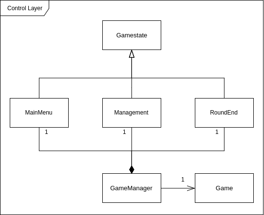
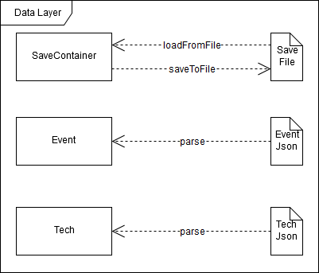

.. role:: cpp(code)
        :language: c++

Technical Design Document
=========================

--------------------

.. sectnum::

.. contents:: Table of Contents

--------------------

Entwicklungssoftware & Methodik
-------------------------------

Programmierung
^^^^^^^^^^^^^^

Das Spiel wird in C++ unter Verwendung des C++11 Standards programmiert.
Zusätzlich wird das Multimedia-Framework SFML 2.4 eingesetzt.

Um die Zusammenarbeit zu vereinfachen wird Git als version control system
benutzt. Die Git Repository befindet sich auf GitHub [#]_ .

Es wird die Methodik der Continuous Integration [#]_ angewandt, d.h. dass jedes
Teammmitglied bzw. jedes feature eine eigene branch hat auf die frei commitet
werden kann.  Die master branch ist protected und pull requests müssen compilen
und von jedem anderen Teammmitglied reviewed werden bevor sie in die master
branch gemerged werden können.  Als CI Server wird Travis [#]_ benutzt.

Zur internen Organisation werden GitHub Funktionen wie Issues, Milestones und
Projects benutzt.

Ein einheitlicher Codingstil ist durch einen vorher verfassten Styleguide
festgelegt.

Dokumentation
^^^^^^^^^^^^^

Die Dokumentation des Projekts erfolgt direkt im Code mittels Docstrings. Zur
Generierung der Dokumentation wird Doxygen [#]_ verwendet.

Input & Plattform
^^^^^^^^^^^^^^^^^

Die Ziel- und Testplattform der Entwicklung sind Windows Rechner.  Das Spiel
wird ausschließlich mit der Maus gesteuert; es wurden noch keine Tastaturbefehle
implementiert. Basierend auf dieser Restriktion wird ebenfalls eine mögliche
Umsetzung auf Touch-Geräten als Langzeit-Meilenstein angestrebt.

Assets
------

Grafik
^^^^^^

Primär werden die Character-Sprites, Backgrounds sowie Texturen von Hand
gezeichnet (Graphics Tablet). Weiteres dazu in der Art Bible.

Grafikformate
^^^^^^^^^^^^^

Das Spiel wird im 16:9 Format dargestellt und besitzt einen optionalen
Fullscreen-Modus. Die Grafiken werden im .png Format abgespeichert.  Es wird
keine 3D-Modelle in der Anwendung geben, da das Spiel ohne simulierte Physik und
räumliche Darstellung auskommt. Alle Modelle und Effekte sind ausschließlich 2D.

Mainscreen und Mockups
^^^^^^^^^^^^^^^^^^^^^^

Der 2D Mainscreen wird eine interaktive Höhlen Übersicht darstellen.  Zusätzlich
zu einer externen Statistik Übersicht wird der Spieler die Möglichkeit haben,
sämtliche Spieler-relevanten Informationen in Form von natürlich-grafischem
Feedback zu erhalten (Details im folgenden Abschnitt). Sämtliche Interaktionen
können ebenfalls von diesem Mainscreen aus ausgeführt werden.

    Screenshots des Management Screens (nicht final)

**Liste an sichtbaren Elementen und Informationen des Mainscreens:**

- Rundenzahl
- Verfügbare Menge an Nahrung
- Verfügbare Menge an Materialien
- Gesamt- und Maximalzahl an Einwohnern
- Menge an nicht-zugewiesenen Höhlenbewohnern (Dargestellt durch Menge an
  interaktiven Höhlenbewohner-Grafiken in der Mitte des Screens)
- Aktionen ‘Hunt’, ‘Collect’, ‘Think’, ‘Make Love’, ‘Improve’
- Button zum Beenden der Runde (‘Go’)
- Balken zur Darstellung bereits ausgewählter und laufender Aktionen
- Aufrufbare Spieloptionen (‘Options’-Button)
- Beenden und automatisches Speichern des Spiels

**Zusätzliche Darstellungsfeatures:**

- Einzelne Ressourcenhaufen (Darstellung variiert nach Menge der jeweiligen
  Ressource)
- Erwerbbare Einrichtungsobjekte
- Umgebungsanimation/-shader (Feuer, Höhlenbewohnertätigkeiten)

Sound
^^^^^

Geräusche sowie Musik befinden sich im .ogg Format. Alle Sounds werden freien
Asset-Bibliotheken entnommen oder selbst mit entsprechender Software (Bsp.
Audacity) kreiert.  Im Mainscreen spielt die Hintergrundmusik sowie ein leises
Knacken des Lagerfeuers in der Mitte der Höhle. Wenn nur noch wenige Runden im
Spiel verbleiben wird die Hintergrundmusik schneller und energischer. Erscheinen
storyrelevante Textboxen sind ‘Höhlenmenschen-Gebrabbel’ Sounds zu hören. Jeder
Buttonklick und das Ende einer Runde werden ebenfalls von Soundeffekten
begleitet.

Interaktion
-----------

Jagen und Sammeln
^^^^^^^^^^^^^^^^^

Eine durch den Spieler anwählbare Aktion; Dauer der Aktion auswählbar; Liefert
pro Höhlenbewohner eine höhere Anzahl des angeforderten Rohstoffes. Anzahl der
Höhlenbewohner, Technologiestufe und durchschnittliches Fitnesslevel bestimmen
Output. Der Hunting Faktor wird durch Forschung erhöht. Einfaches und
schwieriges Jagen; in Notlagen führt schwieriges Jagen zu “High risk, high
reward”; Abzuwägen durch den Spieler

Beispiel:
Nach beendeter Aktion
Food=Food + SUM(Fitness aller beteiligten Caveman)*Hunting Faktor
Chance, das Caveman stirbt, berechnen
Erhöhe Fitness der Beteiligten.

Fortpflanzung
^^^^^^^^^^^^^

Eine durch den Spieler anwählbare Aktion; Dauert 1 Runde; Benötigt genau 2
erwachsene Höhlenbewohner; Das Alter sowie die Geschlechterverteilung der mit
dieser Aufgabe beschäftigten Höhlenbewohner bestimmen den ‘Output’; Wenn
erfolgreich wird der weibliche Höhlenbewohner schwanger und ist 3 Runden lang
nicht verfügbar.

Zu 70% erfolgreich bei heterosexuellem Verkehr.
Bei gleichgeschlechtlichem Verkehr wird niemand schwanger, eine Textbox
erscheint, ‘beide Bewohner fühlen sich erleichtert und schämen sich etwas’
Easteregg: 1% Chance auf schwangere Person bei gleichgeschlechtlicher Aktion (??)

Forschungen
^^^^^^^^^^^

Eine durch den Spieler anwählbare Aktion; Dauert mehrere Runden(abhängig von der
gewählten Forschung und der Intelligenz des forschenden Höhlenbewohners); Aktion
kann jederzeit abgebrochen werden; Erfolgreiches Forschen erhöht Intelligenz.
Forschungen haben verschiedene Effekte auf Ressourcenanhäufung und Events (siehe
Techtree im Game Design Document).

Verbesserungen
^^^^^^^^^^^^^^

Höhle kann unter Aufwendung von Ressourcen erweitert werden; Dauert mehrere
Runden (abhängig von Anzahl der Arbeiter); Verbraucht Baumaterialien; führt zu
größerer Höhlenkapazität und mehr möglichen Einwohnern.

Eine Improve Aktion erhöht die Kapazität um 3 Bewohner und dauert (6-Anzahl der
beteiligten Bewohner) Runden.

Scripted Events
^^^^^^^^^^^^^^^

Darstellung durch Textboxen; werden durch Aktionen oder zufällig getriggert.
Können je nach Inhalt den aktuellen Gamestate beeinflussen; mindestens mit einem
‘Okay’-Button oder anderen anklickbaren Auswahlmöglichkeiten verbunden
(Buttons).  Manche Events passieren spontan nach einer Runde, andere werden eine
bis mehrere Runden vorher angekündigt in Form von Textboxen. (z.B. ‘Das Wetter
ist unruhig, ein Sturm zieht auf.’)

Gameflow
^^^^^^^^

Der Spieler verbringt die meiste Zeit seiner Spielsession im Management-Screen,
wo alle grundlegenden Interaktionsmöglichkeiten für die Runde zur Verfügung
stehen. Zu Beginn der Runde wird dem Spieler eine Auswertung der letzten Runde
(sowie eine Weitererzählung der Spielgeschichte) präsentiert. Anhand der
aktuellen Situation und Events, welche durch die vorhergehende Runde aufgerufen
wurden, entscheidet der Spieler sich für eine Reihe an Aktionen. Diese Aktionen
dauern unterschiedlich lange an und benötigen in einigen Fällen Langzeitplanung
und Voraussicht. Vorallem Ressourcenmanagement steht im stetigen Mittelpunkt -
Menschen und Rohstoffe sollten zu keinem Zeitpunkt üppig vorhanden sein.  Das
Balancing der Erfolgschancen jeder einzelnen Interaktion ist bedeutend für die
Menge an Spielspaß und Immersion, die dem Spieler widerfährt. Das Spiel lebt zu
einem großen Teil von dem variablen Schwierigkeitsgrad, welcher sich mit
andauernder Spiellänge, basierend auf Zufallsereignissen (zu einem geringen
Teil) sowie vorausgehenden persönlichen Erfolgen des Spielers stetig ändert. Das
Spielziel ist durch stetiges Zeitdruckgefühl und der Gefahr, dass das Spiel jede
Runde vorbei sein kann, sobald der Spieler eine schlechte Entscheidung trifft,
permanent ein als wichtig wahrgenommener Faktor.

Klassenverzeichnis & -beschreibungen
------------------------------------

An dieser Stelle soll eine formelle Beschreibung der wichtigsten Klassen
vorgenommen werden.  Die Implementierung soll so gestaltet werden, dass die
Klassen möglichst unabhängig voneinander erstellt werden. Jede Klasse sollte
einen möglichst kleinen Aufgabenbereich abdecken. Für eine genauere
Dokumentation aller Variablen und Methoden werden Docstrings verwendet, wie
unter Punkt 1 erwähnt.

main
^^^^

Erstellt und managed das SFML Renderwindow; Erstellt ein neues Game Objekt.
Enthält die GameLoop und fängt alle benötigten SFML Events ab;

TransformedVector
^^^^^^^^^^^^^^^^^

Template-Klasse mit einem Template Argument, der den Typ der Vektorkomponenten
angibt. Enthält Funktionen Berechnung neuer Positionen aller Objekte nachdem die
Größe des Spielfensters durch den Window-Manager verändert wurde. Sämtliche
Größen und Positionen aller Objekte werden als TransformedVector angegeben.

Rectangle
^^^^^^^^^

Erbt von sf::RectangleShape. Enthält TransformedVector Variablen für Größe und
Position, sowie Funktionen um diese zu verändern.

Textbox
^^^^^^^

Klasse zur Darstellung von jeglichen Textbenachrichtigungen während des Spiels.
Speichert den jeweiligen Text und die verwendete Font. Erbt von Rectangle.

Button
^^^^^^

Erbt von Textbox; Button hat zwei Konstruktoren zur Erzeugung von Buttons mit
und ohne Text.
Bis zu zwei Callbacks (:cpp:`std::function<void()>`) können dem Button gegeben
werden. Funktionen mit argumenten können durch :cpp:`std::bind` benutzt werden.

Beispiel:

.. code:: c++

        Button({100, 50}, {0, 0}, “texture.png”, std::bind(&someFunction, std::ref(someReference)));

Ein :cpp:`nullptr` kann übergeben werden um keinen Callback zu verwenden.

VerticalButtonList
^^^^^^^^^^^^^^^^^^

Hat mehrere Buttons die nach einer bestimmten priority Variable sortiert sind.
VerticalButtonList wird benutzt um die Liste an laufenden Aktionen im Management
State darzustellen.

.. figure:: img/gui-layer.png
    :align: center
    :alt: GUI Layer

    Darstellung der GUI Schicht

Game
^^^^

Enthält Variablen für Ressourcen, einen Vektor aller Caveman im Stamm sowie die
Liste der laufenden Aktionen; Enthält jeweils ein Objekt der Gamestates
MainMenu, Management und RoundEnd und verwaltet den Wechsel zwischen diesen.

Gamestate
^^^^^^^^^

Abstrakte Klasse; enthält Vektoren von Rectangles und Buttons die zusammen alle
zu zeichnenden Objekte eines Gamestates darstellen.

MainMenu
~~~~~~~~

Erbt von Gamestate; Lädt vorherigen Spielstand über
SaveContainer::LoadFromFile() falls eine Savefile vorhanden ist.

Management
~~~~~~~~~~

Erbt von Gamestate; Verwaltet den Großteil der Spiellogik, insbesondere die
Erstellung neuer Aktionen durch ActionFactory.

RoundEnd
~~~~~~~~

Erbt von Gamestate; Enthält step() Funktionen die aufgerufen wird sobald der
Gamestate aktiv wird. Die Funktion sorgt dafür, dass die duration aller aktiven
Aktionen um eins verringert wird. Erstellt weiterhin Textboxen mit allen
Ressourcenänderungen seit der vorherigen Runde und ruft Events über EventFactory
auf. Ruft update() Funktion des SaveContainers auf.

    Darstellung der Control Schicht

Caveman
^^^^^^^

Enthält alle Werte eines Höhlenbewohners (ID, Name, Fitness, Intelligenz,
Geschlecht, Status) sowie einen Button um ihm Aktionen zuzuteilen und seine
Infobox aufzurufen.

ActionFactory
^^^^^^^^^^^^^

Factory Klasse zur Erstellung von Aktionen. createAction() Funktion ruft
entsprechende Konstruktor der verschiedenen Aktionen auf.

Action
^^^^^^

Abstrakte Klasse; Enthält Variablen für die beteiligten Caveman und die Länge
der Aktion. Virtuelle resolve() Funktion die von RoundEnd::step() aufgerufen
wird.

Hunt
~~~~

Erbt von Action; resolve() Funktion berechnet Nahrungszuwachs und Todeschance
der Teilnehmer.

Collect
~~~~~~~

Erbt von Action; resolve() Funktion berechnet Materialienzuwachs

Sex/Reproduce
~~~~~~~~~~~~~

Erbt von Action; kann nur zwei Teilnehmer haben; resolve() Funktion setzt den
Status des weiblichen Höhlenmenschen auf pregnant.

Improve
~~~~~~~

Erbt von Action; resolve() Funktion erhöht Maximalkapazität an Höhlenbewohnern
im Stamm. Improve Aktionen verbrauchen Materialien.

Research
~~~~~~~~

Erbt von Action; resolve() Funktion callt den Callback.
Verschiedene Researches werden durch einen Namen unterschieden.
Jede Research hat einen parent. Die erste tech hat “root” als parent.
Jede Research erfordert eine mindest Intelligence und verbraucht Ressourcen.

    Darstellung der Beziehungen von Action

EventFactory
^^^^^^^^^^^^

Factory Klasse zur Erstellung von Events; createEvent() liest aus der events
File via EventContainer und gibt ein neues Event Objekt zurück.

EventContainer
^^^^^^^^^^^^^^

Liest Events aus der events File. Beispiel für mögliche Notation in der File:

.. code:: javascript

    {
        tags: [ “before_Holzzaun”,
                “after_Toepfern” ],
        name: “Ein wildes Tier hat einen Topf geklaut.”,
        description: “Ein Zaun wäre gut gewesen. :c”,
        resources: { food: -50, buildingMaterial: -20, capacity: 0 },
        death: 0,
        new: 0
    }

Event
^^^^^

Bekommt Konstruktorparameter von EventFactory. Besitzt eine Textbox zur
Darstellung des Events sowie einen Button zum Bestätigen.

SaveContainer
^^^^^^^^^^^^^

Speichert Informationen über das aktuelle Game; Enthält Funktion SaveToFile()
und LoadFromFile()

    Darstellung der Data Schicht

Hilfsfunktionen
^^^^^^^^^^^^^^^

Weitere Dateien die keine instanzierbaren Klassen darstellen sondern zur
besseren Übersicht ausgelagerte Funktionen enthalten.

Buttonfunctions
~~~~~~~~~~~~~~~

Enthält Callback Funktionen die den Buttons aus den Gamestates zugewiesen
werden; unterteilt in sinnvolle namespaces.

Techfunctions
~~~~~~~~~~~~~

Enthält Callback Funktionen für Forschungen.

Eventfunctions
~~~~~~~~~~~~~~

Enthält Callback Funktionen für Events.

Art Bible
---------

--------------------

.. rubric:: footnotes

.. [#] GitHub https://github.com/
.. [#] Continuous Integration https://en.wikipedia.org/wiki/Continuous_integration
.. [#] Travis CI https://travis-ci.org/
.. [#] Doxygen http://doxygen.org/
